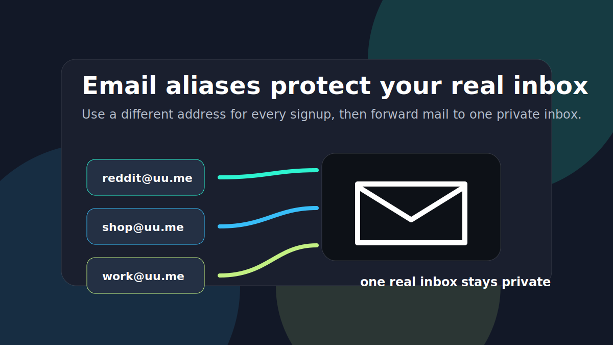
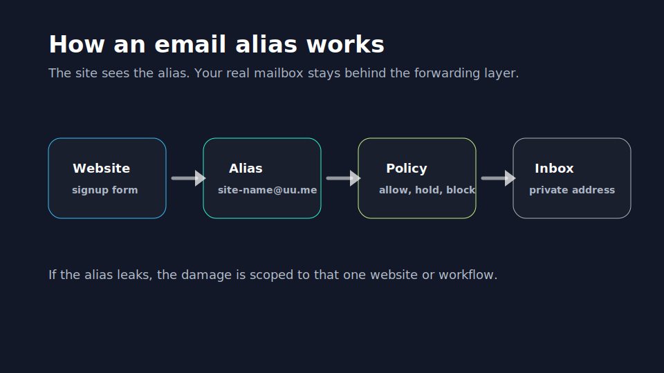
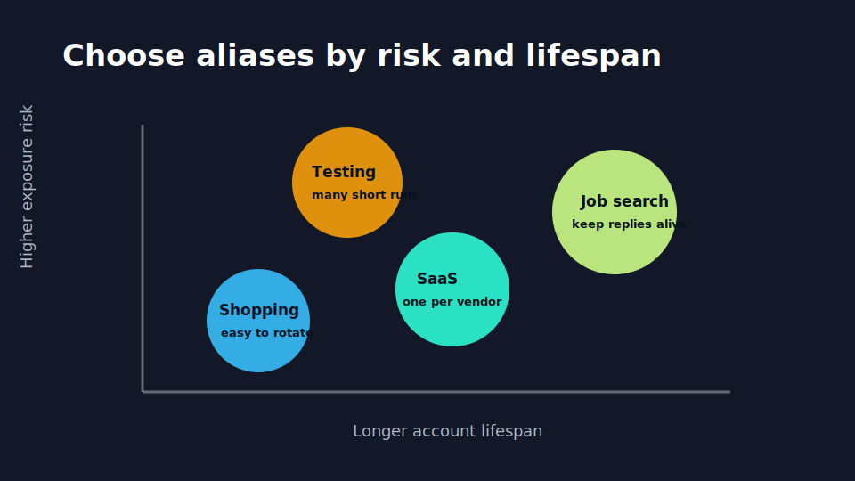
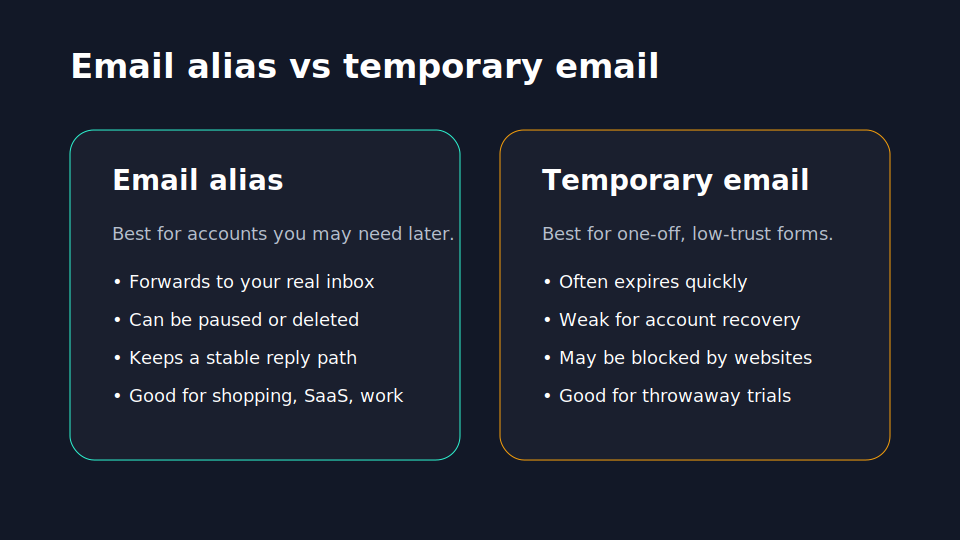

Most people treat their email address like a phone number: one address, reused everywhere, quietly becoming a permanent identifier across shopping, work, newsletters, forums, and old SaaS trials. An **email alias** changes that model. Instead of giving every website your real inbox, you give each context a different address that forwards mail to you.

That sounds small until the first leak, spam wave, or awkward unsubscribe problem. Then the alias becomes the difference between "turn off one address" and "change the email attached to your entire online life."

## Table of Contents

- [What Is an Email Alias?](#what-is-an-email-alias)
- [How an Email Alias Works](#how-an-email-alias-works)
- [7 Practical Ways to Use Email Aliases](#7-practical-ways-to-use-email-aliases)
- [Email Alias vs Temporary Email](#email-alias-vs-temporary-email)
- [Common Mistakes](#common-mistakes)
- [How to Start With UUMail](#how-to-start-with-uumail)
- [FAQ](#faq)

## What Is an Email Alias?

An email alias is an alternate email address that forwards messages to another mailbox. [Apple describes an alias](https://support.apple.com/guide/icloud/what-are-email-aliases-in-icloud-mail-mm074af79454/icloud) as an alternate address that helps keep your real address private, and [Proton describes hide-my-email aliases](https://proton.me/pass/aliases) as addresses that forward mail to your main inbox while protecting the original address. [Namecheap's support docs](https://www.namecheap.com/support/knowledgebase/article.aspx/9627/2215/how-to-create-an-alias-for-namecheap-private-email/) use the same basic model: an alias acts as a forwarding address rather than a separate mailbox.

The important part is not the technical label. The important part is the boundary it creates.

With a normal email setup, your real address becomes a universal account ID. If you use `realname@gmail.com` for every service, every merchant, community, and SaaS tool can store the same identifier. If that address leaks, it is easy to connect activity across services and hard to replace.

With aliases, each signup can get a scoped address:

- `reddit@yourname.uu.me` for communities
- `shopping@yourname.uu.me` for stores
- `jobs@yourname.uu.me` for applications
- `vendor-name@yourname.uu.me` for a specific SaaS vendor

All of them can forward to the same private inbox, but each one can be managed separately. If a store leaks your address, you know which one leaked. If a newsletter ignores unsubscribe requests, you can pause or delete that alias. If a job board starts sending irrelevant mail, you can route or disable only that address.

That is why an email alias is best understood as **identity routing**, not just spam control.

## How an Email Alias Works

The workflow is simple:

1. You create or choose an alias.
2. You enter that alias into a website, app, newsletter, or account form.
3. Incoming mail arrives at the alias service first.
4. The service applies rules and forwards allowed mail to your real inbox.

For the sender, the alias looks like your email address. For you, it behaves like a filterable identity layer.

This is different from creating many full mailboxes. A full mailbox usually has its own login, storage, password, recovery settings, and maintenance burden. An alias is lighter. It can be created for a single purpose while still delivering mail to the inbox you already read.

In UUMail's model, the goal is to make aliases practical for normal daily use:

- **Create addresses quickly** for a signup, project, or category.
- **Forward mail to your real inbox** so you do not need a second email client.
- **Keep account recovery possible** because the alias can remain active.
- **Manage noisy addresses** without changing your private email.

The best alias system is boring in day-to-day use. You should not have to think about it until you need control.

## 7 Practical Ways to Use Email Aliases

The best alias strategy is not "make one alias and reuse it everywhere." That recreates the same problem with a different address. A better strategy is to create aliases by context and risk.

### 1. Use one alias per important vendor

For accounts you may need for years, use a vendor-specific alias. A paid SaaS subscription, domain registrar, cloud tool, bank-like app, or software license deserves its own address.

Example:

- `notion@yourname.uu.me`
- `github@yourname.uu.me`
- `stripe@yourname.uu.me`

If one account's email is exposed in a breach, you know exactly where it came from. You also avoid the mess of using a throwaway inbox for an account that may later need password reset or billing notices.

### 2. Use category aliases for lower-risk shopping

For routine ecommerce, a category alias can be enough:

- `shopping@yourname.uu.me`
- `deals@yourname.uu.me`
- `receipts@yourname.uu.me`

This keeps promotional mail away from your real address and makes it easier to apply inbox filters. If the alias gets too noisy, you can rotate it and keep your private inbox intact.

### 3. Use newsletter aliases to find bad senders

Newsletters are useful until they multiply. Use aliases like `newsletter@yourname.uu.me` for general reading, or create one alias per publication if you want better attribution.

The practical benefit shows up later. If an address that should only receive one newsletter starts getting unrelated ads, you can identify the source. That turns a vague feeling of "my inbox got worse" into a concrete signal.

### 4. Use a job-search alias

Job search is a perfect alias use case because the communication is important but time-bounded. You want recruiters and hiring teams to reach you, but you may not want your permanent personal email circulating through job boards, resume databases, and applicant tracking systems forever.

Use something like:

- `jobs@yourname.uu.me`
- `hiring-2026@yourname.uu.me`

Keep it active while you are searching. Later, reduce notifications, route it to a folder, or disable it if it becomes spam-heavy.

### 5. Use aliases for side projects

Side projects create a surprising amount of email: beta tools, analytics services, domain renewals, hosting providers, API dashboards, payment processors, and customer conversations. A dedicated alias keeps that operational stream separate from personal life.

For example, a solo founder might use:

- `ops-project@yourname.uu.me`
- `billing-project@yourname.uu.me`
- `support-project@yourname.uu.me`

That structure makes it easier to hand off, audit, or shut down a project later.

### 6. Use aliases for development and testing

Developers often need many addresses for staging, QA, invitation flows, and multi-user testing. Using your real address plus random tags can get messy fast. Dedicated aliases make test accounts easier to recognize and clean up.

A useful pattern is:

- `test-001@yourname.uu.me`
- `staging-admin@yourname.uu.me`
- `qa-billing@yourname.uu.me`

The goal is not just privacy. It is operational clarity.

### 7. Use a public alias instead of your real address

If you need to put an email address on a profile, project page, or community bio, use a public alias. That gives people a legitimate way to reach you without exposing the inbox you use for banking, recovery, family, or work.

A public alias can also be replaced if scraping bots find it. Your real inbox stays out of the blast radius.

## Email Alias vs Temporary Email

Email aliases and temporary email addresses both reduce exposure, but they solve different problems.

| Use case | Email alias | Temporary email |
| --- | --- | --- |
| Long-term account | Best fit | Risky |
| Password recovery | Good if alias remains active | Often poor |
| One-time download | Usually fine | Good fit |
| Privacy from marketers | Strong | Strong for short term |
| Reply path | Stable | Often unstable |
| Website acceptance | Usually better | Often blocked |

Use a temporary email when the relationship is truly disposable: a one-time download, a low-trust form, or a trial you do not care about. Use an email alias when the account might matter later.

That distinction is where many people get burned. They use a temporary inbox for something that turns out to be important. Three months later, they need a receipt, login code, refund message, or password reset, and the temporary address is gone.

An alias gives you a middle path: privacy without throwing away account continuity.

## Common Mistakes

### Reusing one alias everywhere

One alias reused across 50 websites is better than exposing your real inbox, but it does not give you leak attribution. If spam arrives, you still do not know which service caused it.

Use vendor-specific aliases for important accounts and category aliases for lower-risk groups.

### Using temporary email for accounts you need to keep

Temporary email is attractive because it is fast. The hidden cost appears when you need future access. If the account stores purchases, billing, community reputation, or work history, use an alias instead.

### Making aliases too hard to understand

Random aliases are private, but they can become hard to manage. Human-readable aliases are easier to audit:

- `reddit@...`
- `newsletter@...`
- `client-acme@...`

For high-risk situations, random aliases may be better. For daily workflow, readable names often win.

### Forgetting internal inbox rules

Aliases work best when paired with folders, labels, or filters. A job-search alias can route to a job folder. A shopping alias can route receipts away from primary mail. A developer testing alias can skip notifications.

The alias separates identity. Your inbox rules separate attention.

## How to Start With UUMail

Start with five aliases, not fifty:

1. One public alias for profiles or contact pages.
2. One shopping alias.
3. One newsletter alias.
4. One job-search or work-opportunity alias.
5. One vendor-specific alias for the next important SaaS account you create.

After a week, check which aliases are noisy and which are useful. Then add more only where the boundary is worth it.

UUMail is being built around that practical workflow: create addresses quickly, forward mail to the inbox you already use, and keep control when a specific address becomes risky or distracting.

The long-term SEO roadmap will expand this guide into dedicated pages for [email forwarding](/blog/), catch-all email, custom domain forwarding, and temporary email alternatives. This article is the starting point: use aliases to make email identity easier to manage before your inbox becomes a permanent public record.

## FAQ

### What is an email alias?

An email alias is an alternate address that forwards messages to another inbox. It lets you receive mail without exposing your real email address to every website or sender.

### Is an email alias the same as a second mailbox?

No. A second mailbox usually has its own login and storage. An alias is usually a forwarding identity that sends mail to an existing inbox.

### Should I use an email alias or temporary email?

Use an email alias for accounts you may need later, including shopping, SaaS, job search, newsletters, and communities. Use temporary email only for truly disposable interactions where account recovery does not matter.

### Can an email alias reduce spam?

Yes. It can reduce the damage from spam because you can pause, filter, or delete the specific alias that receives unwanted mail. It also helps identify which signup caused the problem.

### How many email aliases should I create?

Start with a few high-value categories, then create vendor-specific aliases for important accounts. The right number is the number you can still understand and manage.

